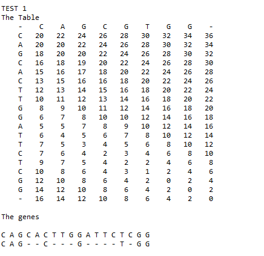
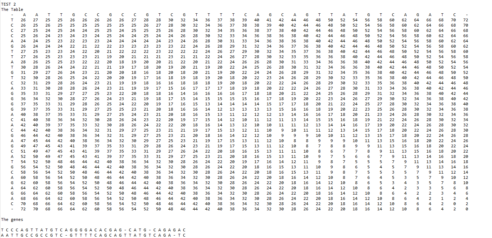

# HomologousGenes
A program for finding the best way to pair 2 genes

Test case 1:

CAGCACTTGGATTCTCGG

CAGCGTGG

Results:

Test case 2:

TCCCAGTTATGTCAGGGGACACGAGCATGCAGAGAC

AATTGCCGCCGTCGTTTTCAGCAGTTATGTCAGATC

Results:

(The mismatch penalty is set to 1, and the gap penalty is set to 2, in the main method. This can be easily adjusted by changing the values passed to the GeneDifferencer constructor.)
